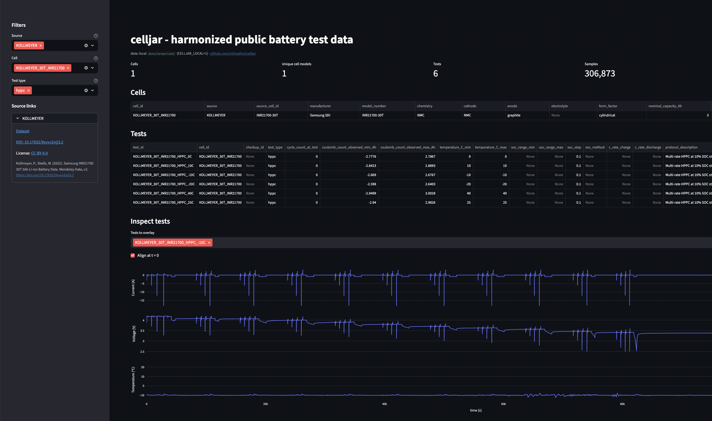

# celljar

[](https://pypi.org/project/celljar/)
[](https://huggingface.co/datasets/mihnathul/celljar)
[](https://pypi.org/project/celljar/)
[](LICENSE)

**Open battery cell test data from 10 published sources, harmonized into one schema you can query in 3 lines.**

If you have ever spent a week wrangling cycler exports from five different labs just to compare two aging curves, celljar is for you. We read the raw deposits, normalize them to a single canonical schema, preserve every authors' citation and license, and publish the result as Parquet + JSON. You query it like a single dataset.

Sources today: ORNL Leaf, HNEI Kollmeyer, MATR (Severson 2019), CLO (Attia 2020), BILLS eVTOL, MOHTAT 2021, NASA PCoE, SNL Preger, Naumann, KOLLMEYER 30T_AGING (Duque/Kollmeyer/Naguib fast-charge aging). 281 cells. 1,494 tests. 183 million timeseries rows. Every row joinable on `cell_id` / `test_id`.



> **Scope:** celljar is a HARMONIZATION layer. It converts units, normalizes the schema, and preserves provenance. It does NOT fit `R_DC`, dV/dQ, OCV, or ECM parameters from V/I/T - those are downstream-tool concerns (PyBOP, equiv-circ-model, custom fitters). The boundary is enforced in the schema via `*_method` fields that document where every derived number came from.

## Quick start

The full harmonized bundle lives at [huggingface.co/datasets/mihnathul/celljar](https://huggingface.co/datasets/mihnathul/celljar). Query it directly - no clone needed:

```python
import duckdb
df = duckdb.sql("""
    SELECT * FROM 'https://huggingface.co/datasets/mihnathul/celljar/resolve/main/timeseries.parquet'
    WHERE test_id = 'ORNL_LEAF_2013_HPPC_25C'
""").df()
```

Pandas and Polars work the same way against the HuggingFace URL.

**Browser viewer** - clone the repo (a PyPI release is on the roadmap):

```bash
git clone https://github.com/mihnathul/celljar.git
cd celljar
pip install -e ".[viewer]"
streamlit run apps/viewer.py    # fetches from HuggingFace by default
```

Pin a release for reproducibility: `CELLJAR_HF_REVISION=v0.2.1 streamlit run apps/viewer.py`.

**Regenerate locally** from raw sources: same setup, then `python examples/demo_end_to_end.py` and `CELLJAR_LOCAL=1 streamlit run apps/viewer.py`.

## Sources

| Source | Chemistry | Cells | Test types | Raw data |
|---|---|---|---|---|
| ORNL Leaf 2013 | mixed (LMO/NCA pouch) | 1 | HPPC × 3 temperatures | bundled |
| HNEI (Kollmeyer 18650PF) | NCA (Panasonic NCR18650PF) | 1 | HPPC, drive cycle, qOCV, capacity check | [download](data/raw/hnei/SOURCE_DATA_PROVENANCE.md) |
| MATR (Severson 2019) | LFP (A123 18650) | 135 | Cycling-to-failure under 72 fast-charge policies | [download](data/raw/matr/SOURCE_DATA_PROVENANCE.md) |
| CLO (Attia 2020) | LFP (A123 18650) | 45 | Closed-loop BO-optimized fast-charge cycling | [download](data/raw/clo/SOURCE_DATA_PROVENANCE.md) |
| BILLS / eVTOL (Bills 2023) | NMC (Sony US18650VTC6) | 22 | eVTOL mission profile + periodic RPTs | [download](data/raw/bills/SOURCE_DATA_PROVENANCE.md) |
| MOHTAT (Mohtat 2021) | NMC (UMich NMC532 pouch) | 31 | Cycle aging + synchronous Keyence laser expansion | [download](data/raw/mohtat/SOURCE_DATA_PROVENANCE.md) |
| NASA PCoE | LCO (vendor undisclosed, 2.0 Ah 18650) | 34 | Cycle aging with EIS-interleaved checkups | [download](data/raw/nasa_pcoe/SOURCE_DATA_PROVENANCE.md) |
| SNL Preger 2020 | LFP / NMC / NCA grid (18650) | 87 | Cycle aging across T × DoD × C-rate matrix | [download](data/raw/snl_preger/SOURCE_DATA_PROVENANCE.md) |
| Naumann 2018/2020 | LFP / graphite (Sony US26650FTC1) | 17 calendar + 17 cycle | Calendar + cycle aging (summary-only, R_DC published) | [download](data/raw/naumann/SOURCE_DATA_PROVENANCE.md) |
| KOLLMEYER 30T_AGING (Duque 2025) | NMC (Samsung INR21700-30T) | 6 | 15-min fast-charge aging across 5 protocols (CC, BC, BCR, BCNP, BCNP_1s) | [download](data/raw/KOLLMEYER_30T_AGING/) |
| KOLLMEYER 30T (BOL) | NMC (Samsung INR21700-30T) | 1 | HPPC, drive cycles, qOCV, capacity check | [download](data/raw/KOLLMEYER_30T/SOURCE_DATA_PROVENANCE.md) |
| KOLLMEYER HG2 (BOL) | NMC (LG INR18650-HG2) | 1 | HPPC, drive cycles, qOCV, capacity check | [download](data/raw/KOLLMEYER_HG2/SOURCE_DATA_PROVENANCE.md) |

## Schema

Four entities joined by `cell_id`, `test_id`, and optionally `checkup_id`:

```
cell_metadata.json       hardware (chemistry, capacity, form factor)
test_metadata.json       protocol, SOH, SOC, provenance, license, checkup_id
timeseries.parquet       V / I / T per-sample + signed running coulomb count (∫I dt)
cycle_summary.parquet    per-cycle aggregates (capacity, R_DC, ...) for aging studies
```

**Conventions:** SI units. Timestamps relative. Missing data is explicit `null`. Current sign matches the source's own convention - look at each source's harmonizer notes for confirmation (most are positive = charge / negative = discharge).

**Provenance is first-class.** Every test row carries `source_doi`, `source_citation`, `source_license`. Every derived quantity carries a `*_method` tag:

| Field | Tag | Meaning |
|---|---|---|
| `soh_pct` | `soh_method` | `capacity_vs_first_checkpoint`, `bol_assumption`, or null |
| `soc_range_min/max` | `soc_method` | `coulomb_count` (computed with clip), `protocol_asserted` (hardcoded from doc), `source_published` (source ships it), or null |
| `resistance_dc_ohm` | `resistance_method` | `source_published` or null. celljar never fits R from V/I/T - that lives downstream |

`checkup_id` groups test segments that belong to the same source-defined Reference Performance Test (RPT) block (currently used by KOLLMEYER 30T_AGING). Null for sources without RPT structure.

Authoritative field list + types in [`schemas/`](schemas/) (JSON Schema). Pandera mirrors at runtime in [`celljar/harmonize/harmonize_schema.py`](celljar/harmonize/harmonize_schema.py).

## Querying

```sql
-- Single test's timeseries
SELECT timestamp_s, voltage_V, current_A, temperature_C
FROM 'data/harmonized/timeseries.parquet'
WHERE test_id = 'ORNL_LEAF_2013_HPPC_25C'
ORDER BY timestamp_s;
```

```sql
-- Cross-source filter - same query works across all sources
SELECT cell_id, test_id, temperature_C_min
FROM 'data/harmonized/tests/*.json'
WHERE test_type = 'hppc' AND temperature_C_min = 25;
```

Same patterns from Python via `duckdb.sql(...).df()` or `pl.read_parquet(..., filters=[...])`.

## What you can do with it

- **Parameterize an ECM / SPM / DFN model** - V/I/T at 1 Hz across every source, with HPPC and qOCV characterization data already harmonized into a consistent shape
- **Run a cross-source SOH / RUL study** - put 6 datasets on the same capacity-vs-cycle axis with one query
- **Compare fast-charge protocols** - MATR (LFP, 72 policies), CLO (LFP, BO-optimized), KOLLMEYER aging (NMC, 5 protocols) all sit alongside each other
- **Build a degradation-mode tracker** - HPPC + qOCV at periodic checkups in Kollmeyer aging let you separate LAM / LLI / impedance growth as a cell ages
- **Benchmark your model on real published data** - every test carries a DOI and citation, so reviewer questions about provenance are pre-answered

**Out of scope:** field / fleet telemetry; ML lifetime prediction (use [BatteryLife (KDD 2025)](https://github.com/Ruifeng-Tan/BatteryLife) - 990 cells, 18 baselines). OCV / R0 extractors, ECM / SPM / DFN fitting, ML modeling all live in separate downstream tools.

## How this relates to other battery data tools

celljar tries to fit alongside, not replace, the other excellent tools in this space:

- **[Battery Data Commons](https://batterycommons.github.io/)** - registry indexing 300+ public battery datasets. Great for discovery; celljar complements it by providing a harmonized data layer for a subset of those sources.
- **[Iontech](https://github.com/shiyunliu-battery/Iontech)** (Shiyun Liu) - curated index of open-source battery monitoring & modeling datasets (RWTH home-storage, NREL failure databank, Stanford second-life, etc.) with paper links. Another good starting point for discovering datasets celljar hasn't yet harmonized.
- **[BatteryLife](https://github.com/Ruifeng-Tan/BatteryLife) / [BatteryML](https://github.com/microsoft/BatteryML)** - cycling-to-failure ML benchmark (KDD 2025). Optimized for lifetime-prediction ML; celljar keeps the full V/I/T timeseries that physics-based parameterization (ECM/SPM/DFN) needs.

## Roadmap

- More sources (CALCE, RWTH, HUST, Tongji, XJTU; Ecker 2015 + Chen 2020 for DFN parameterization)
- PyPI release (`pip install celljar`)
- SOH methodology iteration
- BDF-export converter

## Contributing

See [CONTRIBUTING.md](CONTRIBUTING.md). Issues, ideas, and PRs welcome.

## License & citation

The science here belongs to the original authors; celljar simply puts their data in one place with a shared schema. Please cite their papers when you use the data, and, if it's helpful, celljar alongside.

- **celljar code** (this repository): MIT ([`LICENSE`](LICENSE)).
- **Harmonized bundle** (packaging, schema, derived fields): CC-BY-4.0.
- **Upstream raw data** retains each publisher's original license - see per-source provenance in `data/raw/<source>/`.

To make attribution easy, every `test_metadata` row carries its own `source_doi`, `source_citation`, `source_license`, and `source_license_url`. You can pull the references for any analysis with one query:

```python
import duckdb
duckdb.sql("""
    SELECT DISTINCT source_doi, source_citation, source_license
    FROM 'data/harmonized/tests/*.json'
    WHERE test_id IN ('ORNL_LEAF_2013_HPPC_25C', 'HNEI_NCA_HPPC_25C')
""").df()
```

If you'd like to cite celljar:

```bibtex
@software{celljar,
  author = {Mihna Neerulpan},
  title  = {celljar: Public Battery Test Dataset Harmonization with a Canonical Schema},
  year   = {2026},
  url    = {https://github.com/mihnathul/celljar},
}
```

## Acknowledgments

celljar exists because of the labs and authors who designed, ran, and openly published these experiments - work that took years of careful instrumentation and analysis. Thank you to:

Phillip Kollmeyer (HNEI) · G. Wiggins, S. Allu, H. Wang (ORNL) · K. Severson, P. Attia et al. (MATR, CLO; Stanford / MIT / TRI) · A. Bills et al. (BILLS; CMU) · P. Mohtat et al. (UMich) · B. Saha, K. Goebel (NASA PCoE) · Y. Preger et al. (Sandia) · M. Naumann et al. (TUM) · M. Ecker et al. (RWTH Aachen)
